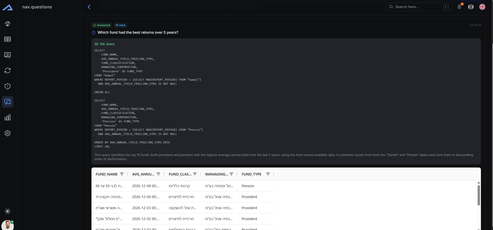
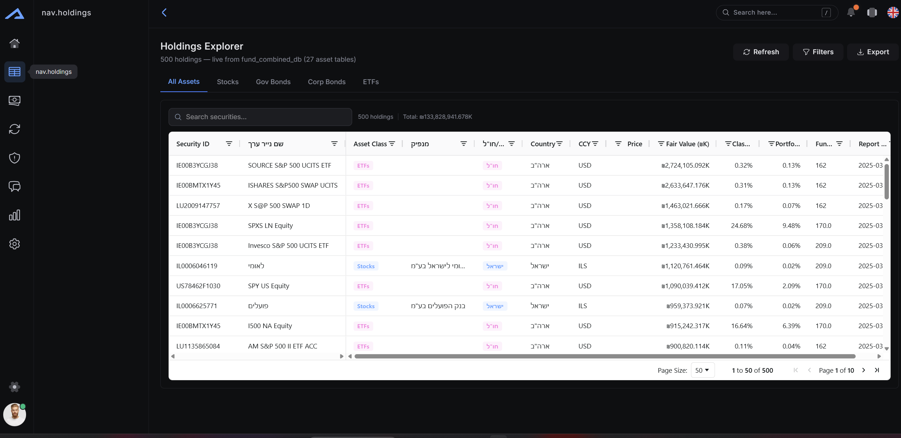
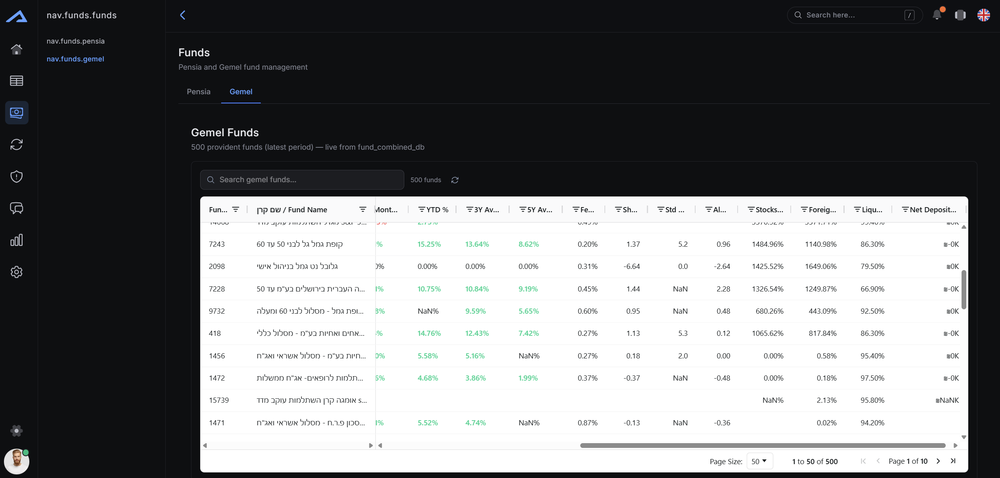

# Ask your fund data in plain language — get SQL-backed answers

**עוזר מחקר לקרנות פנסיה וגמל בישראל — שאלות בשפה טבעית, תשובות ישירות מהנתונים.**

A research assistant for Israeli pension (פנסיה) and provident (גמל) funds. Ask a
question in Hebrew, Russian, or English; the app turns it into a **read-only SQL
query**, runs it against a local dataset of ~24,000 fund records and 29
asset-holding tables, and shows the exact query alongside live results — so every
answer is auditable, not a black box.




---

## The problem · הבעיה

Israeli fund data is public but hard to work with: dozens of spreadsheets,
Hebrew column names, provident vs. pension differences, and metrics (yield, fees,
risk, exposures) scattered across tables. Answering "which fund had the best
5-year return?" means hand-writing SQL against a 34-table schema.

**הבעיה:** הנתונים ציבוריים אך מפוזרים — שמות עמודות בעברית, הבדלים בין גמל
לפנסיה, ועשרות טבלאות. לשאלה פשוטה צריך לכתוב SQL ידני מול סכימה מורכבת.

This app closes that gap: a natural-language question in, a **verifiable SQL
query + results** out.

## What it does

- **Client Questions (NL → SQL).** Type a question in Hebrew / Russian / English.
  The AI returns the SQL and the app executes it — you see both the query and the
  rows. (Screenshot above.)
- **Holdings Explorer.** Browse the underlying securities across 29 asset tables
  (stocks, government/corporate bonds, ETFs…) with fair values in ₪.
- **Funds — Gemel & Pensia.** Compare ~2,500 provident and ~500 pension funds by
  yield, fees, Sharpe ratio, exposures, and more.
- Plus reports, validation, ingestion, and admin views.

## Screenshots

| Holdings Explorer | Funds (Gemel) |
|---|---|
|  |  |

## Quickstart (2 terminals)

```bash
# 1. Backend — Flask API + SQLite  (http://localhost:5000)
cd backend
pip install -r requirements.txt
python fund_ai_app.py

# 2. Frontend — React + Vite  (http://localhost:5173)
cd frontend
npm install
npm run dev
```

Put the SQLite database at `backend/fund_combined_db.db` (it is intentionally not
committed — large and local). Full guide, including auth and AI modes:
[`SETUP.md`](SETUP.md).

**It works out of the box with no API key** — the default AI mode is `mock`
(offline). Sign in with the seed credentials created on first run (see
[`SETUP.md`](SETUP.md#authentication)).

## How it works

```
Browser (React / Vite, :5173)
    │  /api/*   (Vite dev proxy)
Flask API (:5000)  ──►  SQLite  fund_combined_db.db  (read-only, 34 tables)
    │
    └── AI for "Client Questions": Claude API / Claude Agent SDK / Mock
```

The AI never touches the database directly. It only proposes SQL; the backend
validates and executes it under a read-only connection. Structured output is
forced via a single `run_sql_query` tool call, so the model returns exactly
`{ sql, explanation }`.

### AI modes (switchable in the UI or via `AI_MODE`)

| Mode | What it is | Needs |
|------|------------|-------|
| **`mock`** (default) | Offline, deterministic SQL from keyword heuristics — runs on the real DB with **no key** | nothing |
| **`api`** | Anthropic **Claude Messages API** (`claude-opus-4-8` by default) | `ANTHROPIC_API_KEY` |
| **`sdk`** | **Claude Agent SDK** via a local `claude` subscription | `claude-agent-sdk` + login |

## Reliability & safety

- **Read-only by construction.** The SQLite connection is opened `mode=ro` with
  `PRAGMA query_only = ON`; only `SELECT` / `WITH` are allowed and a keyword
  blocklist rejects `INSERT/UPDATE/DELETE/DROP/ALTER/CREATE/PRAGMA`. A wrong SQL
  guess can read, never write.
- **Every answer shows its SQL.** The generated query is displayed with the
  results, so a human can verify what was actually asked of the data — no
  "trust me" numbers. (The *Air Canada* chatbot case is a reminder of why an AI
  answer needs an auditable source.)
- **JWT authentication** with hashed passwords (Werkzeug + PyJWT), stored in a
  separate `auth.db`.

## Data & privacy

- **No secrets or personal data in the repo.** API keys come from environment
  variables or the UI (kept in memory unless you opt to remember, then written
  only to a git-ignored file). The 160 MB fund database and the users DB are
  git-ignored.
- **AI providers don't train on the data.** Anthropic's API does not train on
  business API traffic, and a Zero-Data-Retention posture is available — relevant
  under Israel's **Privacy Protection Amendment No. 13 / PPA** (in force Aug 2025),
  the **EU GDPR**, and Israel's **adequacy status** with the EU.
- **Fully offline option.** `mock` mode answers with zero network calls; a local
  model (e.g. Ollama) is a natural next step for air-gapped use.

## Tech stack

- **Backend:** Python, Flask, SQLite, PyJWT, Werkzeug, Anthropic SDK / Claude Agent SDK
- **Frontend:** React 19, Vite, Tailwind CSS, React Router, AG Grid
- **AI:** Claude (Opus 4.8 / Sonnet 5 / Haiku 4.5 / Fable 5), forced tool-use for structured SQL

## Project structure

- [`backend/`](backend/) — Flask API (`fund_ai_app.py`), auth (`auth.py`),
  AI provider modes (`ai_provider.py`), DB schema.
- [`frontend/`](frontend/) — React/Vite UI.
- [`SETUP.md`](SETUP.md) — local setup, authentication, AI modes.
- [`.env.example`](.env.example) — safe environment template.

## License

[MIT](LICENSE) © 2026 Refael Myshiakov
